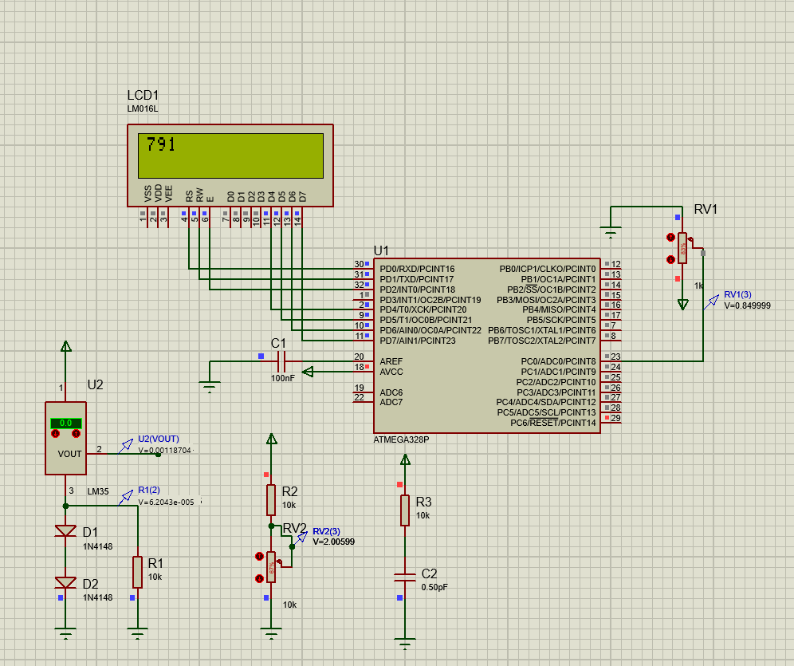

# AVR ADC Voltage Monitor

An embedded systems project that implements a simple digital voltmeter using an AVR microcontroller's internal 10-bit ADC and a 16x2 LCD display.

---
##  Overview

This project demonstrates analog-to-digital conversion using the built-in ADC module of an AVR microcontroller. The system reads an analog voltage from ADC channel 0, converts it into a digital value using polling mode, and displays the result in real time on a 16x2 LCD.
The internal 1.1V reference voltage is used to improve measurement stability.

## Features

- 10-bit ADC resolution (0–1023)
- Internal 1.1V reference voltage
- Polling-based ADC conversion
- LCD real-time display
- Prescaler set to 128 for stable ADC clock
- Digital input buffer disabled for reduced noise

## Hardware Requirements

- AVR Microcontroller (ATmega16 / ATmega32 / ATmega328P)
- 16x2 LCD display
- Analog signal source (e.g., potentiometer)
- 5V power supply
- AVR programmer

---

## ADC Configuration

| Parameter            | Value              |
|----------------------|-------------------|
| Resolution           | 10-bit            |
| Reference Voltage    | Internal 1.1V     |
| Prescaler            | 128               |
| Mode                 | Single Conversion |
| Channel              | ADC0              |

## Voltage Calculation

Voltage = (ADC_Value / 1023.0) × 1.1V

 

